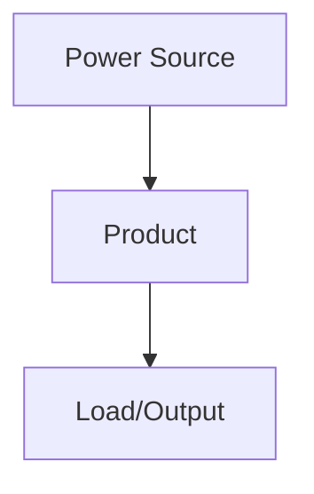

# Documentation Guidelines for Jeep LJ Electrical System {#documentation-guidelines-for-jeep-lj-electrical-system}
## Writing Style

**BE SUCCINCT.** Technical documentation should be clear, direct, and concise.

- Use tables for specifications and connections
- Use bullet lists for features and procedures
- Avoid marketing language and unnecessary adjectives
- State facts directly without elaboration
- Every word should serve a purpose

## System Architecture

### Controllers & Power Distribution

- **Command Touch CT4:** Street-legal lighting (headlights, turn signals)
- **PMU (PMU24):** Programmable power management (DRL, brake, reverse, accessories)
- **SwitchPros SP-1200:** Offroad/auxiliary lighting (roof, ditch, fog, rock lights)
- **Front Battery:** Constant power, switched power
- **Rear Battery:** High-current accessories, inverter, winch

### Lighting Organization

- **03-series:** Street-legal/DOT-required lighting (CT4/PMU controlled)
- **Offroad:** Auxiliary lighting (SwitchPros controlled)
- Keep street-legal and offroad lighting separate

### Key Components

- **LP6 headlights:** CT4 controlled, DOT-compliant
- **Maxbilt tail lights:** 4-function (brake/turn/reverse/marker)
- **Turn signals:** CT4 with GPS auto-cancel, diode isolation from brake circuit
- **DRL/Parking:** PMU Out 9, auto-off when headlights on

## Documentation Standards

### Product Documentation

For every major product (controllers, lighting, hardware), include:

**Standard format:**

```markdown
**Type:** [Product Name/Description]
**Model:** [Exact Model Number]
**Manufacturer:** [Company Name]
**Product Page:** [Product Name](https://manufacturer.com/product-url)
**Installation Guide:** [Guide Name](https://url-to-pdf-manual)
**Wiring Diagram:** [Included/See Below/Missing]

**Product Image:**


**Wiring Diagram:**


\```
```

**Examples:**

```markdown
**Type:** Baja Designs LP6 DOT LED Headlights
**Model:** LP6 DOT
**Product Page:** [Baja Designs LP6](https://www.bajadesigns.com/lp6)
**Installation Guide:** [LP6 DOT Wiring](https://www.bajadesigns.com/.../install.pdf)
**Product Image:**


```

**Guidelines:**

- Product Page: Link to manufacturer's official product listing
- Installation Guide: Link to PDF manual/instructions (prefer manufacturer site)
- Product Image: Store in `images/` directory, use descriptive filename
- Images: 800px width max, JPG or PNG format
- If product page doesn't exist, link to manufacturer's product search page
- Always prefer manufacturer URLs over reseller URLs

**Tracking Product Documentation:**

Product documentation is tracked in individual files, NOT in a central tracking file.

To find incomplete product documentation:

```bash
# Find all TBD/placeholder/missing items
grep -r "TBD\|placeholder\|Missing" *.md

# Find files missing product images
grep -r "Product Image:" *.md | grep -v "images/"

# Find files missing manufacturer manuals
grep -r "Installation Manual:" *.md | grep "TBD"
```

Each file is responsible for its own product documentation completeness.

**Wiring Diagram Requirements:**

- Every electrical component MUST have a wiring diagram
- **Manufacturer Diagrams (Primary):**
  - Link to official wiring diagram from manufacturer's manual/documentation
  - Embed manufacturer diagram image if available
  - Always prefer manufacturer diagrams over custom diagrams
- **System Integration Documentation (Secondary):**
  - **Tables preferred** for products with many outputs/connections (e.g., PMU, controllers)
  - Use Mermaid diagrams ONLY for simple power flow (2-5 connections max)
  - Complex Mermaid diagrams are difficult to read - use tables instead
  - Show: power source (battery/bus bar), connections to other systems, wire gauges
  - Example: PMU output table showing all 24 outputs, loads, triggers
- Mark as "Missing" if no manufacturer diagram is available
- Mark as "See Installation Guide" if diagram is in linked manual

### Required Sections

1. Component type, model, quantity
2. Power source, draw, wire gauge
3. Control method
4. Wiring summary (power, ground, routing)
5. Outstanding items checklist

### Wire Specifications

Always specify:

- Source (e.g., "PMU Out 17")
- Wire gauge (e.g., "14 AWG")
- Color when relevant
- Load in amps

### Outstanding Items

Use checkbox format:

```markdown
- [ ] Specific actionable item
- [ ] Another specific task
```

## Technical Conventions

### Power Sources

- **CONSTANT:** Always-on power (batteries)
- **SWITCHED:** Ignition-controlled power
- **RUN:** Ignition in RUN position

### Diode Isolation

When combining circuits (brake + turn), always specify:

- Diode type (e.g., 1N4001)
- Diode ratings (e.g., 1A, 50V)
- Circuit diagram showing isolation

### Admonitions

Use mkdocs admonitions sparingly:

- `!!! info` for important cross-references
- `!!! warning` for safety-critical information
- `!!! note` for clarifications

## Documentation Categories

Documentation uses category-based numbering where file numbers indicate the category:

### Category 1: Power Systems (01-*)

- 01-power-generation.md
- 01-front-battery-distribution.md
- 01-rear-battery-distribution.md

### Category 2: Engine & Critical Systems (02-*)

- 02-power-distribution.md (PMU24)
- 02-starter.md
- 02-radiator-fan.md
- 02-hvac.md
- 02-horn.md
- 02-wipers.md
- 02-firewall-ingress.md

### Category 3: Lighting (03-*)

- 03-lighting-overview.md
- 03-headlights.md
- 03-turn-signals.md
- 03-drl-parking.md
- 03-tail-brake-reverse.md
- 03-offroad-lighting.md

### Category 4: Cabin & Body Control (04-*)

- 04-cabin-body-control.md

### Category 5: Control Interfaces (05-*)

- 05-control-interfaces-overview.md
- 05-command-touch-ct4.md
- 05-switchpros-sp1200.md
- 05-dashboard-controls.md
- 05-gauge-cluster.md

### Category 6: Audio (06-*)

- 06-audio.md

### Category 7: Communication (07-*)

- 07-communication.md

### Category 8: Offroading & Auxiliary (08-*)

- 08-auxiliary-systems.md
- 08-recovery-systems.md
- 08-air-system.md

### Category 9: Meta (09-*)

- 09-wire-routing.md
- 09-project-management.md

### Cross-References

Link to related documentation:

```markdown
See [PMU24 Power Distribution](../01-power-systems/04-pmu/index.md) for circuit details.
```

## Common Mistakes to Avoid

1. **Don't mix SwitchPros and CT4/PMU content** - they control different systems
2. **Don't duplicate information** - link to authoritative source instead
3. **Don't create new files unnecessarily** - update existing documentation
4. **Don't use marketing language** - "high-performance" → "6A draw"
5. **Don't leave specifications as TBD** without noting in Outstanding Items

## When Making Changes

1. Read existing files first - understand the current organization
2. Update cross-references if moving or renaming content
3. Maintain consistent formatting with existing files
4. Update overview files when adding new components
5. Be specific in outstanding items - avoid vague TODOs
